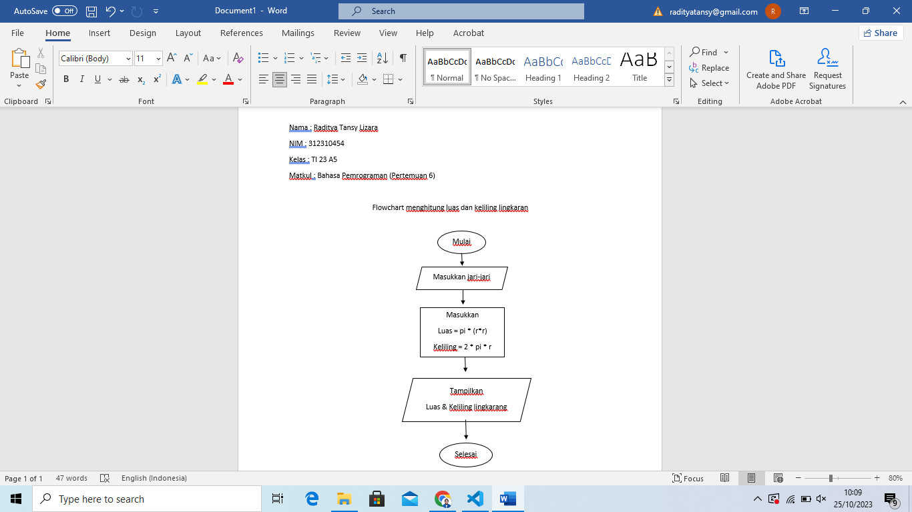
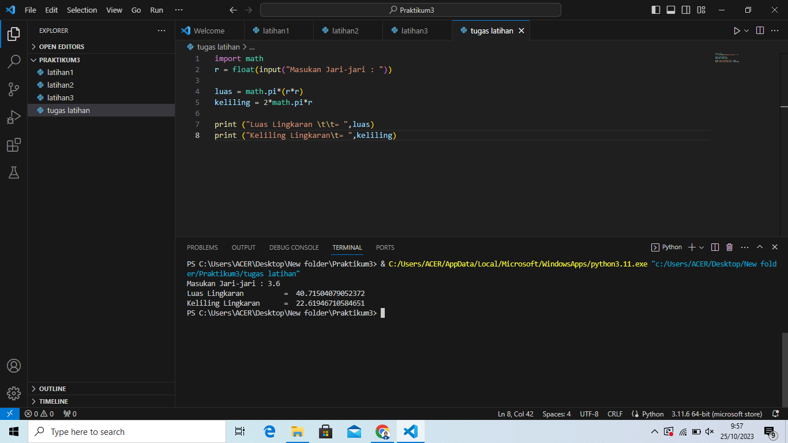

Mengimport modul math. Kemuadian menggunakan fungsi input() yang nilainya di konversi ke tipe data float (bilangan riil). Kita sudah mendapat nilai phi dan jari-jari. Selanjutnya kita bisa menghitung luas dan keliling sesuai dengan rumus-nya masing-masing. Selanjutnya kita tampilkan hasilnya dengan fungsi print(). sintak \t merupakan karakter espace yang berfungsi untuk membuat tab. dalam kasus ini agar sejajar karakter sama dengan (=) nya.

